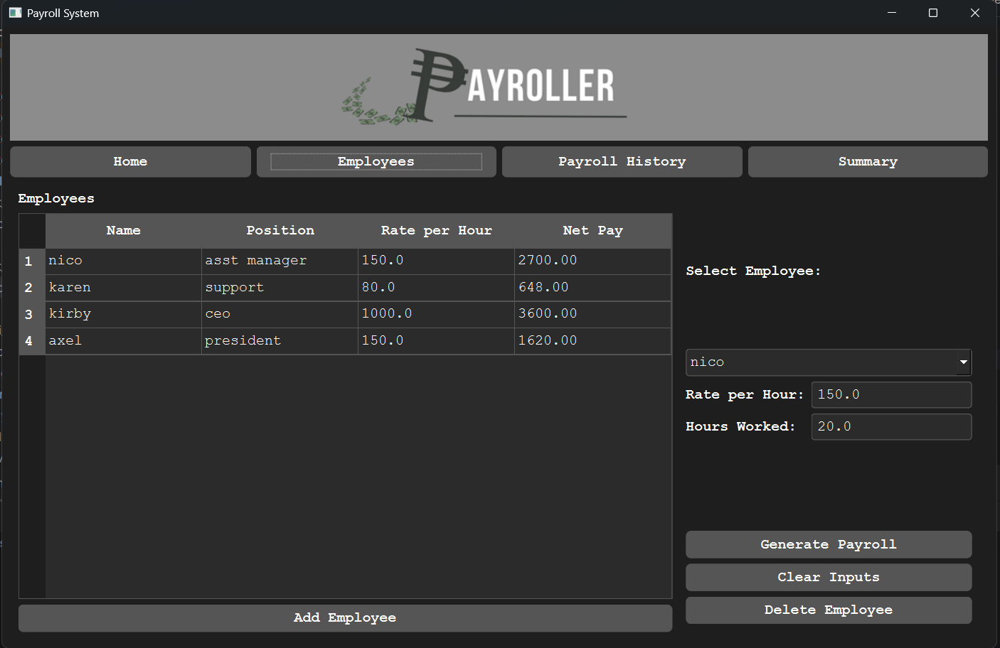
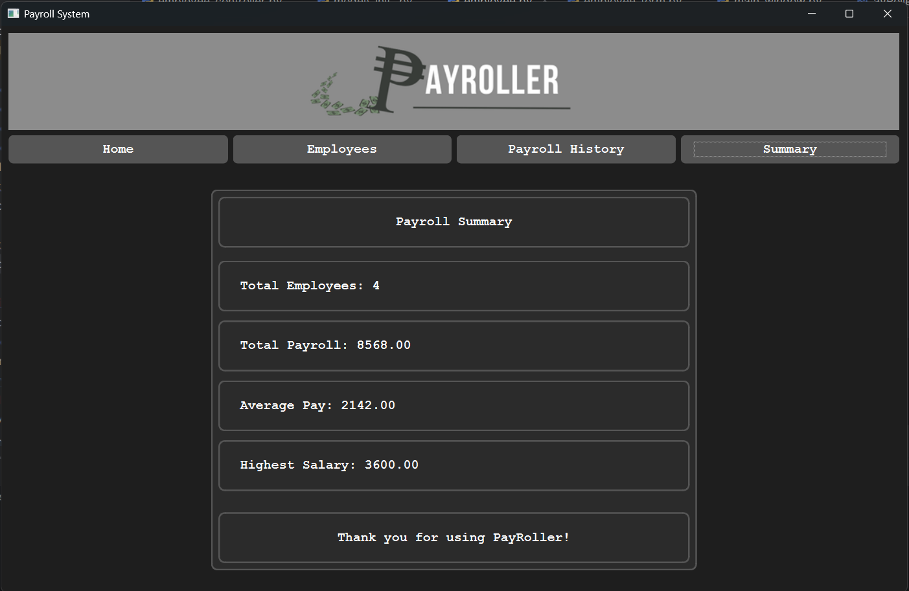

# IT5-payroller
# 🧾 PayRoller – Payroll Management System

PayRoller is a **Python + PyQt6-based Payroll Management System** designed to help organizations efficiently manage employee data, salary computation, and payroll history — all within a user-friendly graphical interface.

---

##  Overview

This project was developed as part of an IT5 subject requirement to demonstrate understanding of **GUI programming, database management, and object-oriented design** using Python.

The system allows users to:

* Manage employee records
* Generate payrolls automatically
* Store and view payroll history
* Provide a simple, modern, and intuitive interface

---

##  Features

✅ **Employee Management** – Add, edit, and delete employee records
✅ **Payroll Generation** – Automatically compute salaries, deductions, and net pay
✅ **Payroll History** – View and manage historical payroll transactions
✅ **Database Storage** – Uses SQLite for secure and local data handling
✅ **Modern GUI** – Built using PyQt6 with a clean, neutral (black-gray-white) theme for aesthetic and simple ui display

---

##  Project Structure

```
IT5-payroller/
│
├── assets/               # Images, icons, or logo used in the GUI
├── control/              # Database handling and Backend logic  (controllers)
├── model/                # Employee/payroll and computation models
├── ui/                   # User interface layout and PyQt6 widgets
│
├── main.py               # Entry point of the system
├── payroll.db            # SQLite database file
└── README.md             # Project documentation
```

---

##  Installation & Setup

### 1️⃣ Clone the repository

```bash
git clone https://github.com/neckolescano/IT5-payroller.git
```

### 2️⃣ Navigate to the project folder

```bash
cd IT5-payroller
```

### 3️⃣ (Optional) Create a virtual environment

```bash
python -m venv .venv
source .venv/Scripts/activate   # for Windows
```

### 4️⃣ Install required dependencies

```bash
pip install PyQt6
```

### 5️⃣ Run the system

```bash
python main.py
```

---

##  Technologies Used

* **Python 3.x**
* **PyQt6** – for GUI design
* **SQLite3** – for local database storage
* **OOP Concepts** – for modular and maintainable code

---

##  Design Theme

* **Background:** Black
* **Buttons:** Light gray
* **Text:** White
* **Style:** Minimal, professional, and neutral aesthetic

---

##  Gui Preview

###  Home Page


###  Employee Management


###  Payroll History


###  Payroll Summary


---

##  Developer

**Nicho Lescano**
*BSIT Student | IT5 – Payroll System Project*
 neckolescano36@gmail.com
 October 2025

---

##  License

This project is for **educational purposes** only.
You may use or modify the code for learning and academic demonstrations.
